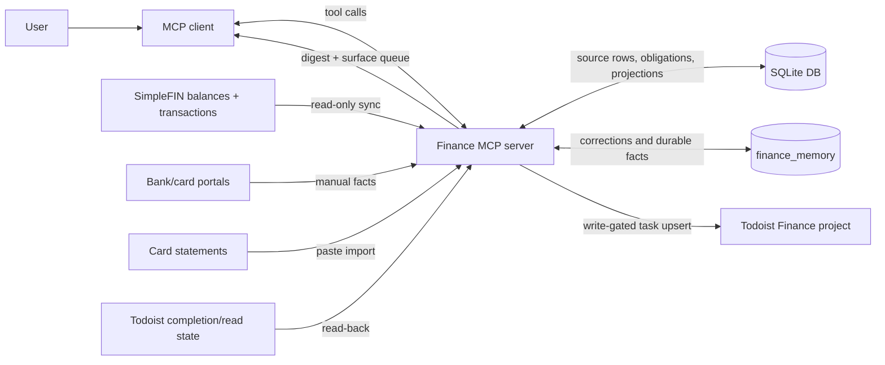

# Financial Agent Design Doc

## Metadata

- Status: implemented baseline; parallel-run validation before sole-source use
- Created: 2026-06-25
- Project: `personal-finance-agent`
- Repository: `/Users/aorlando/dev/financial-agent-mcp`
- Reference method: `/Users/aorlando/dev/reference-notes/design-docs/refactoring-english-effective-design-doc.md`

## Objective

Give an AI agent a deterministic, local, evidence-backed way to read, model, and
surface personal cash flow without treating unverified detections, stale feeds,
or task-board reminders as financial truth.

## Background

The finance workflow has two jobs that are easy to confuse. The first is reading
the current state: balances, transactions, statements, due dates, and task-board
state. The second is deciding what those facts mean for near-term cash flow. If
either job becomes an ungrounded chat answer, the user can act on a number that
has no source row behind it.

This server keeps the boundary explicit. It ingests facts into a local SQLite
database, models expected cash movement as dated obligation and income
instances, and surfaces only the actions that need attention. The Model Context
Protocol (MCP) client can ask for a digest or projection, but the reported
figures are computed by tools over local data, not remembered from a previous
conversation.

The current system is suitable for daily parallel-run use. It is not, by itself,
a sole trusted source for money decisions until enough live runs have matched
the legacy/manual workflow and the remaining cutover criteria are accepted.

## Related Documents

- [README.md](../README.md)
- [docs/diagrams.md](diagrams.md)
- [docs/specs/todoist-reconcile-and-cleanup.md](specs/todoist-reconcile-and-cleanup.md)

## Goals

- Ground every headline balance, due date, projection endpoint, and cash-flow
  figure in local source rows.
- Produce deterministic day-by-day projections from dated obligation and income
  instances.
- Keep recurring-charge discovery as a review queue until a human decision
  promotes a candidate into canonical obligations and instances.
- Handle stale or incomplete feeds through explicit manual balance snapshots and
  card-statement imports instead of hidden assumptions.
- Surface daily attention items in one place: status digest, review queue, and
  optional Todoist tasks.
- Keep Todoist writes gated, idempotent, and recoverable from drift.
- Preserve a private/live-data boundary so the public copy can stay sanitized.

## Non-Goals

- Replace the manual or legacy finance workflow as the sole trusted source
  without a separate cutover decision.
- Move money, pay bills, change bank data, or mutate upstream financial feeds.
- Treat Todoist as the canonical finance model.
- Let a language model infer cash-flow truth from raw transaction text without a
  tool-computed source row.
- Provide tax, investment, or legal advice.
- Become a hosted, multi-user finance service.

## Scenarios

### Daily Read

1. The user starts the daily finance loop.
2. The MCP client calls `run_background_sync` for the target date.
3. The server syncs readable sources, scans recurring-charge candidates,
   reconciles expected payments, checks drift, evaluates guardrails, runs the
   deterministic verification phase that proves the source rows tie together,
   and records an auditable run.
4. The client calls `get_daily_digest`.
5. The user sees a status color, working cash, projected low point, upcoming
   obligations, sensitivity to estimates, and the highest-priority review items.
6. Before stating a headline number, the client can call `verify_grounding` to
   confirm the number traces back to source rows.

### Stale Balance or Missing Card Feed

1. A feed has a stale balance or no transaction-level data for a card.
2. The user records a portal balance with `set_manual_balance` or pastes a card
   statement with `import_card_statement`.
3. The server records the explicit input as local source data.
4. Card-spend inputs can feed statement estimates without directly reducing the
   checking-account projection.

### New Recurring Charge

1. `scan_charge_onboarding_candidates` detects a repeated merchant pattern in
   transaction history.
2. The candidate appears in the review queue with evidence and proposed
   policies.
3. The user accepts, rejects, defers, or asks for more evidence through
   `record_charge_onboarding_decision`.
4. Only an accepted candidate can be applied into canonical obligations and
   dated instances.

### Todoist Drift

1. The daily surfacing job prepares due items from the surface queue.
2. `surface_due_items_to_todoist` uses stable surface keys and the
   `todoist_emissions` ledger so repeated runs update the same task instead of
   creating duplicates.
3. `list_todoist_project` gives the agent a read-only view of the Finance
   project through the server.
4. `reconcile_todoist_project` can classify drift and, when writes are enabled,
   apply only the safe cleanup rules documented in the Todoist reconcile spec.

## Diagram

More detailed architecture, state, and relationship diagrams live in
[docs/diagrams.md](diagrams.md).

## Glossary

- MCP: Model Context Protocol, the tool-call interface between the AI client and
  this local server.
- Source row: a persisted local row that supports a reported financial fact.
- Obligation: a durable expected bill, payment, transfer, or income stream.
- Obligation instance: one dated occurrence of an obligation. Projections move
  from instances, not from vague recurring labels.
- Recurring-charge candidate: a detected pattern that is not cash-flow truth
  until accepted and applied.
- Surface queue: the prioritized set of items worth showing to the user today.
- Todoist emission: a ledger row that maps one surface item to one Todoist task, stores its current evidence hash, and can persist a `create_pending` transport intent.
- Parallel run: using the agent alongside the legacy/manual workflow to compare
  results before cutover.
- Sole trusted source: the state where the agent replaces the legacy/manual
  workflow for routine decisions. This is not the current claim.

## Constraints

- The system is local-first. Credentials come from the configured `.env` file or
  process environment at runtime and are not committed.
- The database is a local SQLite copy. The server does not mutate the original
  upstream bank feed.
- SimpleFIN availability and freshness vary by account, so the model must allow
  manual balance snapshots and pasted statements.
- Todoist is an output and attention surface. Reads can be used for reconciliation,
  but writes stay off unless `TODOIST_WRITE_ENABLED` is explicitly truthy.
- Recurring-charge candidates cannot affect the projection until promoted into
  canonical obligations and instances.
- Private live data and credentials must stay out of the public repository and
  out of public history.

## Service Objectives

- Grounding: every headline number in `get_finance_status` and
  `get_daily_digest` should be traceable through tool output and pass
  `verify_grounding` before the agent states it as fact.
- Projection integrity: only active dated instances should move the deterministic
  cash-flow projection; candidates and Todoist tasks must not move it directly.
- Write safety: with `TODOIST_WRITE_ENABLED` unset or false, Todoist write tools
  must perform no external mutation.
- Idempotency: repeated surfacing of unchanged daily items should update or skip
  existing Todoist tasks rather than create duplicates.
- Conservation: each current action-queue item must map to an open managed task,
  a dismissal for the same evidence hash, or a named member of the live
  `finance-status` rollup. A partial Todoist list is never healthy evidence.
- Completion semantics: a checkbox acknowledges the task evidence it displayed.
  New evidence can resurface under the same key. Only `followup:<id>` completions
  resolve a source record, and a checkbox never approves a financial review.
- Recovery: background runs, sync runs, action outbox rows, and Todoist emissions
  should leave enough state to explain what happened after a failed run.
  Surface creates record intent before transport, then use the embedded marker to
  adopt a task after an uncertain response or retry after verified absence.

## Monitoring and Alerting

This is a local personal system, so there is no pager. Operational health is
surfaced through the product loop:

- `background_runs` records run status, trace id, timing, and summary.
- `operation_events` records ordered steps inside a background run.
- `sync_runs` records SimpleFIN sync outcomes.
- `get_job_health` summarizes scheduled-job health.
- `get_daily_digest` turns drift, stale snapshots, guardrail findings, and sync
  failures into visible daily review items.

## Timeline and Current State

- Implemented: local MCP server, SQLite schema, SimpleFIN ingest, manual balance
  snapshots, card-statement import, obligations and instances, recurring-charge
  candidate queue, reconciliation, drift detection, guardrails, daily digest,
  Todoist surfacing, Todoist project reconciliation, memory records, validation,
  parity comparison, and grounding checks.
- Current readiness: daily parallel-run use.
- Not yet accepted: sole-source cutover.
- Next decision: define the evidence threshold for retiring the legacy/manual
  workflow, including how many clean daily runs are enough and which mismatch
  severities block cutover.

## Interfaces

The primary interface is the MCP tool catalog registered by
`src/financial_agent/server.py`. The main workflows are:

- Status and proof: `get_finance_status`, `get_daily_digest`,
  `verify_grounding`.
- Ingest: `sync_simplefin`, `set_manual_balance`, `import_card_statement`,
  `reconcile_todoist_completions`.
- Modeling: obligation and income tools, recurring-charge onboarding,
  reconciliation, drift detection, guardrails, and statement-cycle tools.
- Surfacing: `get_surface_queue`, `surface_due_items_to_todoist`,
  `list_todoist_project`, `reconcile_todoist_project`.
- Todoist task edits (board maintenance): `create_todoist_task`,
  `update_todoist_task`, `complete_todoist_task`, `reopen_todoist_task`,
  `delete_todoist_task` (all write-gated; no external call unless enabled).
- Operations: `run_background_sync`, `get_background_run`,
  `list_background_runs`, `get_job_health`.
- Verification: `run_verification`, `list_verification_findings` (filter by
  `source` to separate deterministic checks from adversarial flags).
- Adversarial review: `run_adversarial_review` (see below).
- Cutover support: `run_live_validation`, `compare_to_legacy`.

The command-line entry points are:

- `uv run financial-agent-mcp`
- `uv run financial-agent-daily`
- `uv run financial-agent-ui`
- `python -m financial_agent.adversarial --as-of <YYYY-MM-DD>` — runs the
  adversarial review outside any MCP call (used by the Claude Code Stop hook).
  Safe with the gate off: it prints a disabled note and exits 0.

## Adversarial Review

The deterministic verification phase proves the model ties out internally with
pure code, so a finding is a genuinely broken identity. The adversarial review
adds a second, non-deterministic opinion that code cannot give: it hands an
independent reviewer the highest-leverage rows — the estimated, low-confidence
outflows on the projected low point, the large estimated obligations that move
the forecast, and the freshly-classified recurring-charge candidates with their
evidence — and asks it to point at whatever looks wrong.

Findings are attention-routing ("look here, this looks off"), never verdicts.
The reviewer is a language model and can be wrong, so its flags are stored
advisory-labeled, never move the projection, and never resolve a deterministic
check. They persist into `verification_findings` tagged `source='adversarial'`
and surface alongside the deterministic checks in `get_daily_digest`.

The reviewer is the Claude Code CLI (`claude -p`) spawned as a read-only
subprocess on the user's Claude subscription via OAuth; `ANTHROPIC_API_KEY` is
removed from the child environment so no metered API key is ever used. The phase
is capability-gated: it runs only when `FINANCE_AGENT_ADVERSARIAL` is truthy and
the `claude` binary is on `PATH`, so it stays inert offline and in tests. It is
fail-open — a missing CLI, error, timeout, or unparseable reply writes nothing
and the run continues.

Three enforcement layers reach the same review, so a material change cannot end
a session unreviewed regardless of how the work happened:

1. Daily run (code): a gated `adversarial_review` step in `run_background_sync`,
   between `verify` and `surface_due_items`.
2. Inside an MCP call (surfaced reads): the `run_adversarial_review` tool runs it
   on demand; `get_daily_digest` surfaces the persisted flags as a pure read.
3. Outside the MCP call: a `Stop` hook in `.claude/settings.json` runs the module
   entry point once per turn. `PostToolUse`-on-mutations is a stricter
   alternative; Stop-once-per-turn is the cost-sane default.

## Dependencies and Infrastructure

- Language/runtime: Python 3.11 or newer.
- Package manager: `uv`.
- Storage: local SQLite database selected by `FINANCE_AGENT_DB_PATH`.
- Protocol: MCP over stdio.
- Required package: `mcp`.
- Optional live sources: SimpleFIN access URL and Todoist API token/project id.
- Runtime config: `FINANCE_AGENT_ENV`, `FINANCE_AGENT_DB_PATH`,
  `TODOIST_WRITE_ENABLED`, `WORKING_ACCOUNT_HINT`, and the source credentials in
  the configured `.env`.

## Security

The main attack surface is local access to a server that can read sensitive
financial data and, when explicitly enabled, write Todoist tasks. The design
keeps the riskiest writes behind configuration gates:

- SimpleFIN ingest is read-only against the upstream feed.
- Todoist write-back is off unless `TODOIST_WRITE_ENABLED` is truthy and the
  token plus project id are present.
- Secret values are not returned by config reads; only safe booleans such as
  `has_simplefin` and `has_todoist` are surfaced.
- The server should be registered only in trusted local MCP clients because tool
  results can contain personal financial data.
- The adversarial reviewer subprocess gets no tools and is isolated from this MCP
  server (`--strict-mcp-config` plus an empty `--mcp-config`), so it cannot
  recurse or reach the filesystem. Every row it judges is embedded inline in the
  prompt and treated as untrusted text, closing the prompt-injection to file-read
  path. Its environment has `ANTHROPIC_API_KEY` removed so it can only use the
  user's subscription OAuth, never a metered API key.

## Privacy

The live financial data belongs in local SQLite databases and local environment
files, both outside version control. Documentation, public examples, and the
sanitized public repository must not include real balances, account identifiers,
transaction histories, credentials, or private account hints.

When publishing, treat the private repo and live database as internal surfaces.
Publish only current sanitized contents, and re-check generated docs for paths,
identifiers, and example values before making them public.

## Legal Considerations

This tool supports personal finance operations, but it is not financial, tax, or
legal advice. If the project is distributed beyond personal/local use, review the
terms for SimpleFIN, Todoist, and any other data provider before changing how the
data is stored, shared, or automated.

## Logging

Logs and ledgers are part of the safety model:

- `background_runs` and `operation_events` explain each daily run.
- `sync_runs` explains feed sync outcomes.
- `action_outbox` records pending or dry-run external actions.
- `todoist_emissions` records which surface item maps to which Todoist task.
- `memory_records` stores durable corrections, decisions, and facts.

These records should avoid credentials and should not be copied into public
artifacts when they contain live financial details.

## Open Issues

- Cutover threshold: how many clean parallel-run days are enough before the
  legacy/manual workflow can be retired?
- Mismatch policy: which parity differences are blockers, which are review
  items, and which are acceptable model differences?
- Todoist cleanup apply mode: which live-sampled task patterns are safe enough
  to delete automatically instead of only reporting?
- Recurring-charge automation: which high-confidence candidates, if any, can be
  auto-modeled without weakening the human review boundary?
- Backup and restore: what is the expected local backup story for the SQLite
  database and the configured `.env`?

## Resolved Issues

- Projection source of truth: dated obligation and income instances drive the
  forecast; raw candidates and Todoist tasks do not.
- Candidate boundary: recurring-charge discovery writes review candidates, not
  canonical obligations.
- Todoist boundary: Todoist is an attention surface with idempotent emissions,
  not the finance model.
- Stale feed handling: manual balance snapshots and card-statement imports are
  explicit source rows, not hidden chat assumptions.
- Card-statement treatment: card-spend inputs can feed statement estimates
  without directly reducing checking cash flow.
- Public/private boundary: private live-data workflows stay in this repo; public
  publishing requires sanitized current contents and history discipline.

## Alternatives Considered

- Use the language model directly over spreadsheets, statements, or chat
  history: rejected because the user needs source-backed numbers and repeatable
  projections.
- Make Todoist the finance source of truth: rejected because task boards drift
  and lack enough structure for cash-flow semantics.
- Write directly to upstream financial systems: rejected because the current
  product need is read, model, and surface, not money movement.
- Accept all recurring-charge detections automatically: rejected for the baseline
  because false positives can distort the forecast; discovery stays separate
  from canonical modeling.
- Build a hosted service first: rejected because local-first storage and private
  data boundaries are central to the current workflow.
