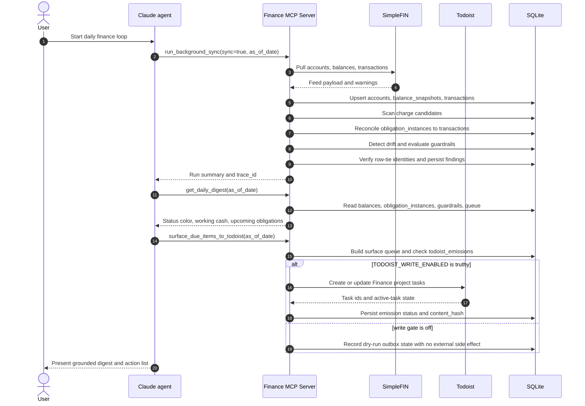
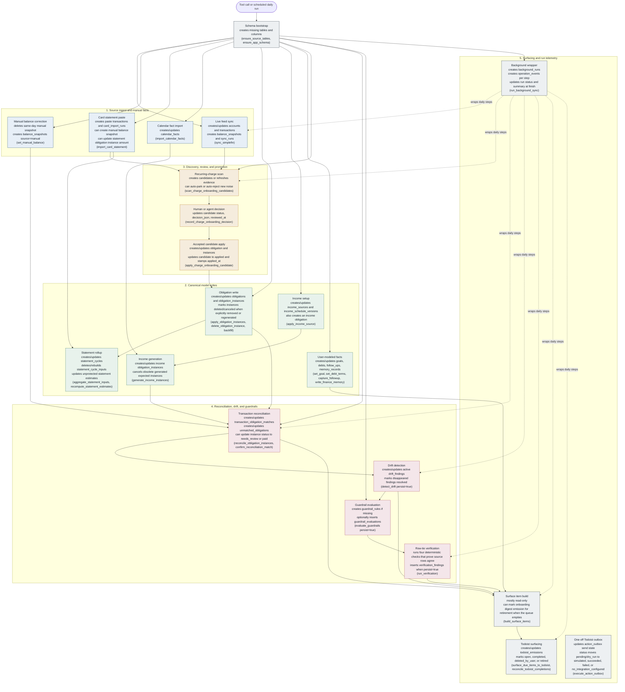
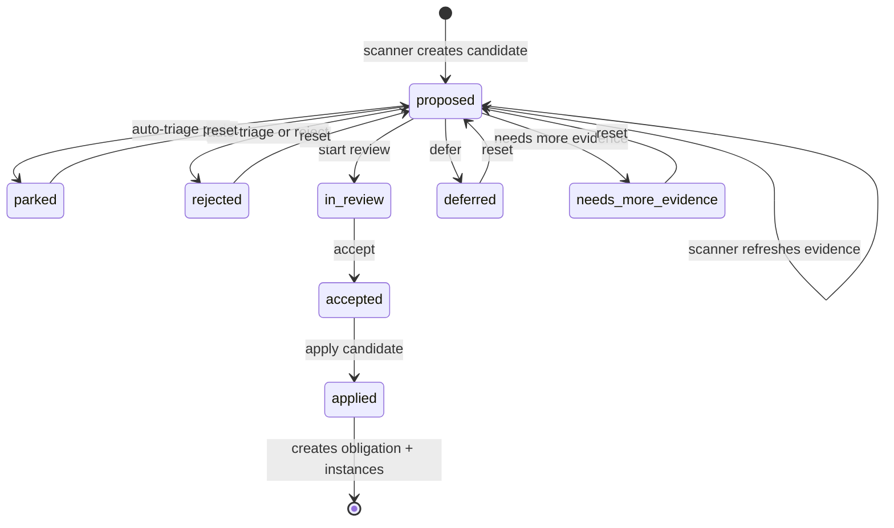
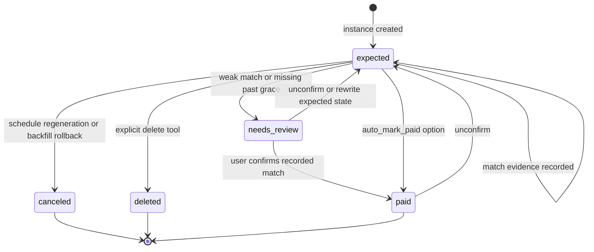
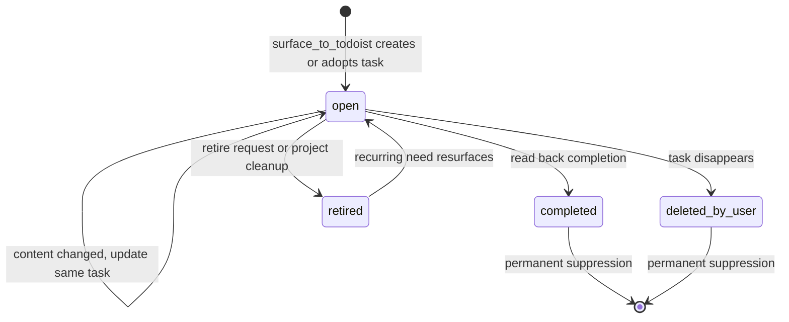
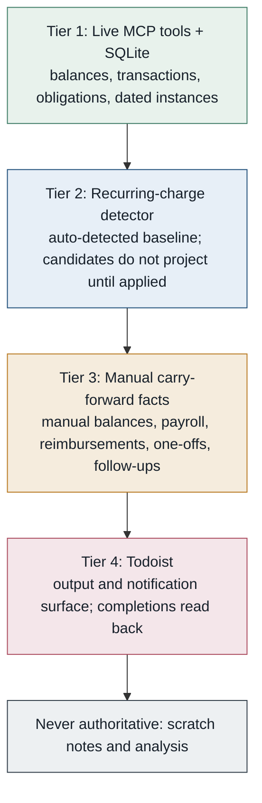
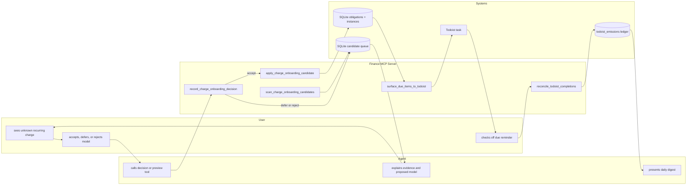
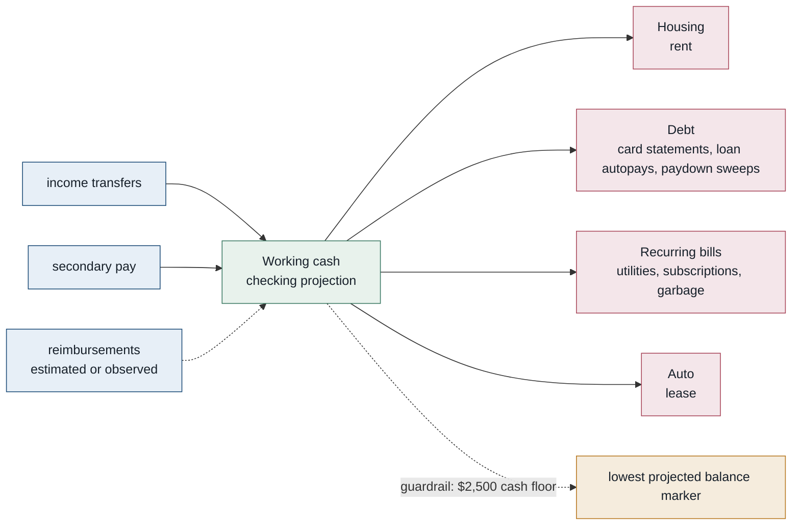

# Finance Agent Diagrams

Durable Mermaid diagrams for the local finance MCP server. These diagrams describe the intended architecture and state model without depending on local SQLite data, credentials, or temporary rendered artifacts.

## System Architecture

## Daily Finance Loop

```mermaid
flowchart LR
    subgraph Ingest["1. INGEST"]
        Sync["sync_simplefin<br/>pull SimpleFIN balances + transactions"]
        Manual["set_manual_balance<br/>record current portal balance when a feed is stale"]
        CardPaste["import_card_statement<br/>paste a card statement when a card has no live feed (dry-run by default)"]
        TodoistRead["reconcile_todoist_completions<br/>read completion state for emitted tasks"]
    end

    subgraph Model["2. MODEL"]
        Discover["scan_charge_onboarding_candidates<br/>discover recurring charge candidates"]
        Reconcile["reconcile_obligation_instances<br/>match expected payments to transactions"]
        Drift["detect_drift<br/>flag stale estimates, missing payments, amount changes"]
        Guardrails["evaluate_guardrails<br/>cash floor, drift threshold, debt order"]
        Projection["get_finance_status / get_daily_digest<br/>project cash flow from obligation_instances"]
        Verify["run_verification<br/>prove source rows tie together, persist findings"]
    end

    subgraph Surface["3. SURFACE"]
        Queue["get_surface_queue<br/>collect what needs attention"]
        Digest["get_daily_digest<br/>status color, working cash, upcoming obligations"]
        Push["surface_due_items_to_todoist<br/>upsert tasks through todoist_emissions"]
    end

    Ingest --> Model --> Surface
    Surface -. "daily schedule / next read-back" .-> Ingest
```

## Daily Run Sequence

## Entity Relationship Diagram

This is the durable data model the MCP server reads and writes. It includes the
source tables created for synced account data plus the app-owned tables created
by `ensure_app_schema`. Some relationships are logical rather than enforced
SQLite foreign keys because several links are stored as stable ids or JSON
evidence.

```mermaid
erDiagram
    ACCOUNTS ||--o{ BALANCE_SNAPSHOTS : has
    ACCOUNTS ||--o{ TRANSACTIONS : posts
    ACCOUNTS ||--o{ DEBTS : can_back
    ACCOUNTS ||--o{ CARD_IMPORT_RUNS : imports

    OBLIGATIONS ||--o{ OBLIGATION_INSTANCES : schedules
    INCOME_SOURCES ||--o{ INCOME_SCHEDULE_VERSIONS : versions
    INCOME_SOURCES ||--o{ OBLIGATION_INSTANCES : generates
    INCOME_SCHEDULE_VERSIONS ||--o{ OBLIGATION_INSTANCES : generated_by
    CALENDAR_FACTS }o--o{ INCOME_SOURCES : may_adjust_pay_dates

    TRANSACTIONS ||--o{ TRANSACTION_OBLIGATION_MATCHES : observed_match
    OBLIGATION_INSTANCES ||--o| TRANSACTION_OBLIGATION_MATCHES : match_evidence
    OBLIGATION_INSTANCES ||--o| UNMATCHED_OBLIGATIONS : unmatched_state
    OBLIGATIONS ||--o{ DRIFT_FINDINGS : can_have
    OBLIGATION_INSTANCES ||--o{ DRIFT_FINDINGS : can_have

    CHARGE_ONBOARDING_CANDIDATES }o--o| OBLIGATIONS : may_promote_to
    CHARGE_ONBOARDING_CANDIDATES }o--o{ TRANSACTIONS : evidence_json

    OBLIGATIONS ||--o{ STATEMENT_CYCLES : target_statement
    OBLIGATION_INSTANCES ||--o| STATEMENT_CYCLES : statement_instance
    STATEMENT_CYCLES ||--o{ STATEMENT_CYCLE_INPUTS : rolls_up
    OBLIGATION_INSTANCES ||--o{ STATEMENT_CYCLE_INPUTS : input_charge

    GOALS ||--o| TODOIST_EMISSIONS : may_surface
    FOLLOW_UPS ||--o| TODOIST_EMISSIONS : may_surface
    OBLIGATIONS ||--o{ FOLLOW_UPS : may_link
    GUARDRAIL_RULES ||--o{ GUARDRAIL_EVALUATIONS : evaluated_as
    BACKGROUND_RUNS ||--o{ OPERATION_EVENTS : emits

    ACCOUNTS {
        string id PK
        string name
        string org
        string kind
        string currency
        string first_seen_at
        string last_seen_at
    }

    BALANCE_SNAPSHOTS {
        int id PK
        string account_id FK
        float balance
        float available
        string recorded_at
        string source
        string manual_note
    }

    TRANSACTIONS {
        string id PK
        string account_id FK
        string posted
        string transacted_at
        float amount
        string payee
        string source
    }

    SYNC_RUNS {
        int id PK
        string started_at
        string finished_at
        string mode
        int transactions_inserted
        int transactions_updated
        string error
    }

    OBLIGATIONS {
        string id PK
        string name
        string kind
        string cadence
        string status
        string source
        bool autopay
        bool amount_discretionary
    }

    OBLIGATION_INSTANCES {
        string id PK
        string obligation_id FK
        string due_date
        float amount
        string direction
        string status
        string amount_status
        string cash_flow_treatment
        string statement_target_obligation_id
    }

    INCOME_SOURCES {
        string id PK
        string person
        string employer
        string status
        float default_amount
        string active_from
        string active_until
    }

    INCOME_SCHEDULE_VERSIONS {
        string id PK
        string income_source_id FK
        string schedule_type
        string rule_json
        string valid_from
        string status
    }

    CALENDAR_FACTS {
        string id PK
        string fact_type
        string fact_date
        string related_entity_type
        string related_entity_id
        string status
    }

    CHARGE_ONBOARDING_CANDIDATES {
        string id PK
        string merchant_key
        string display_name
        string status
        string candidate_type
        string cash_flow_treatment
        float priority_score
        string existing_obligation_id
    }

    STATEMENT_CYCLES {
        string id PK
        string target_obligation_id FK
        string statement_instance_id FK
        string cycle_close_date
        float input_sum
        int input_count
    }

    STATEMENT_CYCLE_INPUTS {
        string statement_cycle_id PK
        string obligation_instance_id PK
        float input_amount
        string due_date
    }

    CARD_IMPORT_RUNS {
        string id PK
        string account_id FK
        string imported_at
        string statement_close_date
        int txn_count
        float total_spend
    }

    TRANSACTION_OBLIGATION_MATCHES {
        string obligation_instance_id PK
        string transaction_id FK
        string match_type
        float match_score
        string as_of_date
    }

    UNMATCHED_OBLIGATIONS {
        string obligation_instance_id PK
        string obligation_id
        string due_date
        int age_days
        bool past_grace
        string status
    }

    DRIFT_FINDINGS {
        string id PK
        string finding_type
        string severity
        string obligation_id
        string obligation_instance_id
        string status
        string resolved_at
    }

    ACTION_OUTBOX {
        string id PK
        string idempotency_key
        string action_type
        string status
        bool dry_run
        string external_task_id
    }

    TODOIST_EMISSIONS {
        string surface_key PK
        string todoist_task_id
        string status
        string content_hash
        string last_seen
        string retire_requested_at
    }

    BACKGROUND_RUNS {
        string id PK
        string trace_id
        string run_type
        string status
        string as_of_date
        string started_at
        string finished_at
    }

    OPERATION_EVENTS {
        int id PK
        string run_id FK
        int event_seq
        string event_type
        string status
        string event_time
    }

    GUARDRAIL_RULES {
        string id PK
        string rule_type
        float threshold_value
        string severity_default
    }

    GUARDRAIL_EVALUATIONS {
        string id PK
        string rule_type
        string evaluation_date
        bool passed
        string finding_json
    }

    GOALS {
        string id PK
        string name
        float target_amount
        string deadline
        string source_account
        string status
    }

    DEBTS {
        string id PK
        string account_id FK
        string name
        float apr
        string balance_source
        bool is_revolving
    }

    FOLLOW_UPS {
        string id PK
        string text
        string surface_when
        string priority
        string status
        string linked_obligation_id
    }

    MEMORY_RECORDS {
        string id PK
        string kind
        string text
        string metadata_json
        int token_count
        string source
    }

    OBLIGATION_MIGRATION_LOG {
        string id PK
        string run_timestamp
        string source_type
        bool dry_run
        int created_obligations
        int created_instances
    }
```

## Object Creation And Update Flow

This diagram answers "when are the durable objects created or updated?" Read-only
tools such as `get_finance_status`, `get_daily_digest`, and list tools are
intentionally omitted unless they call a helper that writes state.

## Candidate Lifecycle

## Obligation Instance Lifecycle

## Todoist Emission Lifecycle

## Source Of Truth Precedence

## User / Agent / System Swimlane

## Cash-Flow Template

This is a structural view only. Live amounts should come from `get_finance_status` or `get_daily_digest`; do not hard-code private balances into docs.

