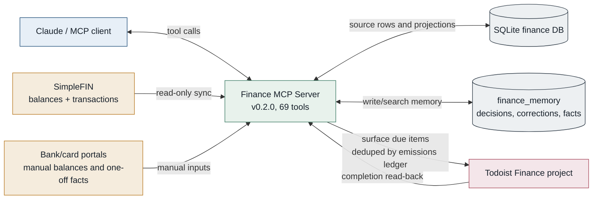
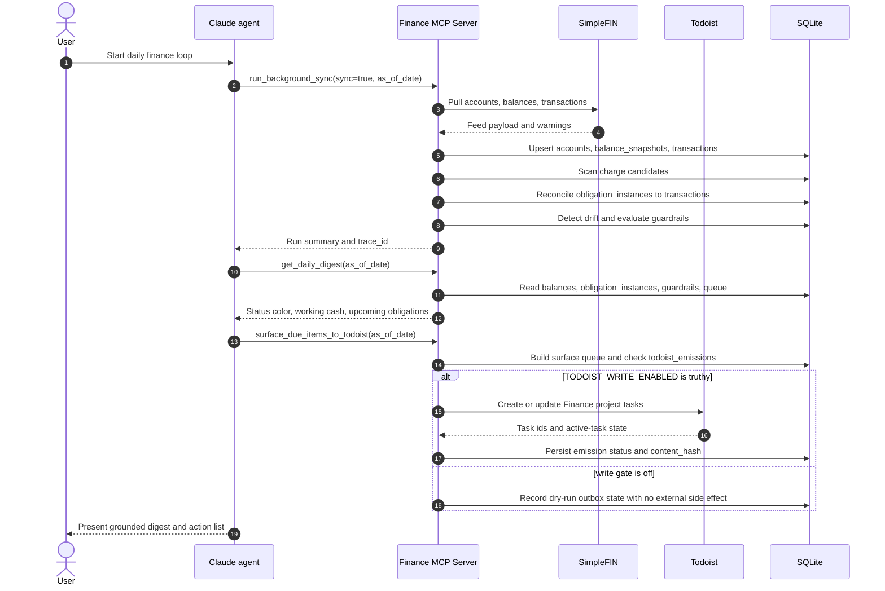
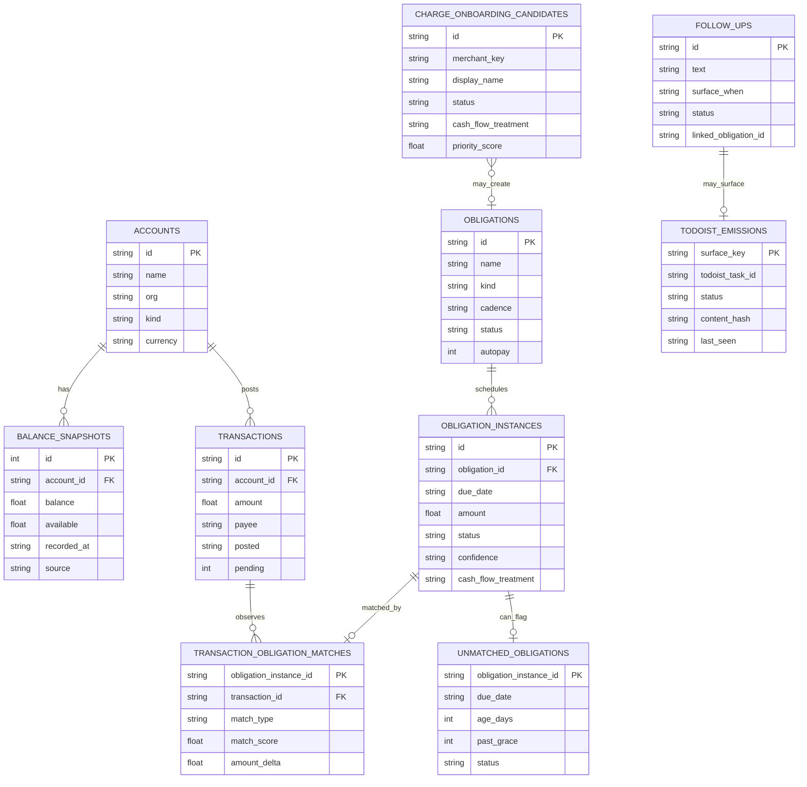
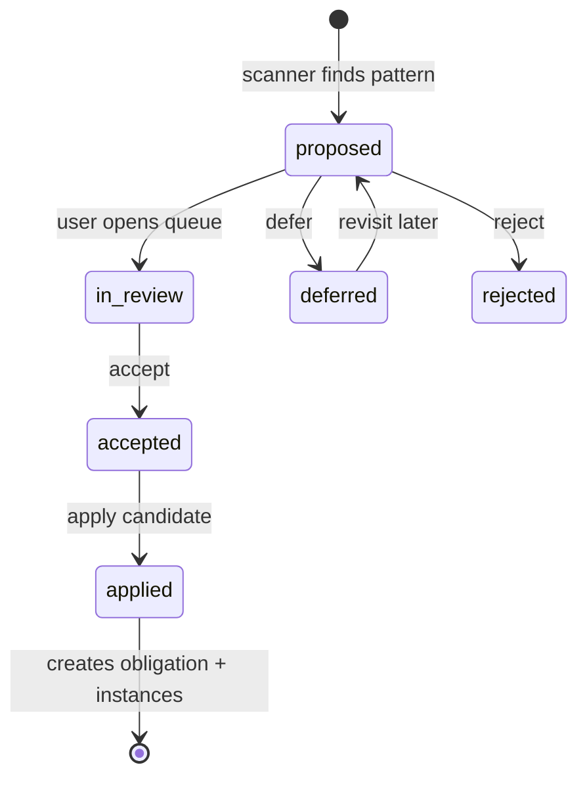
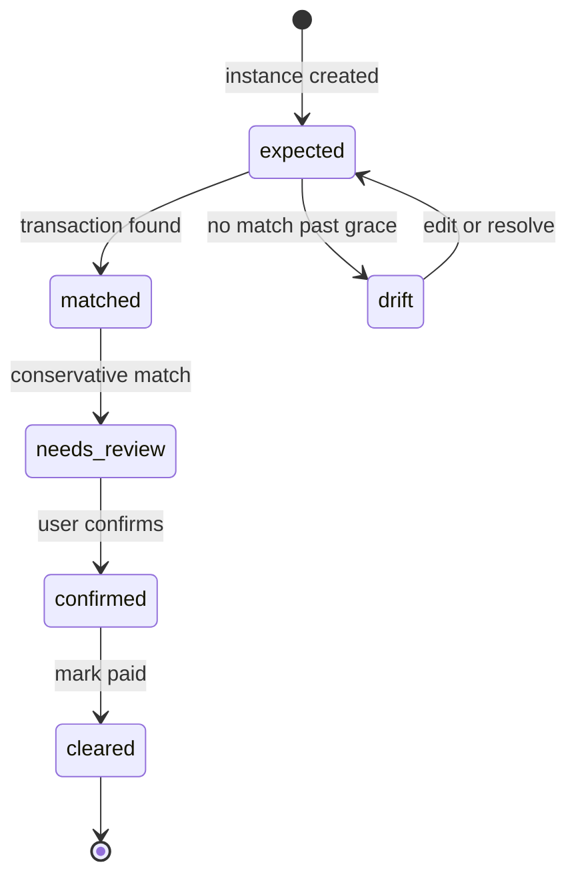
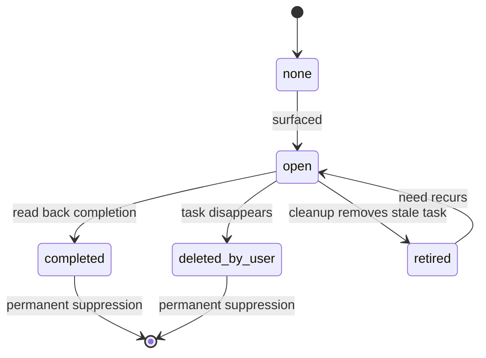
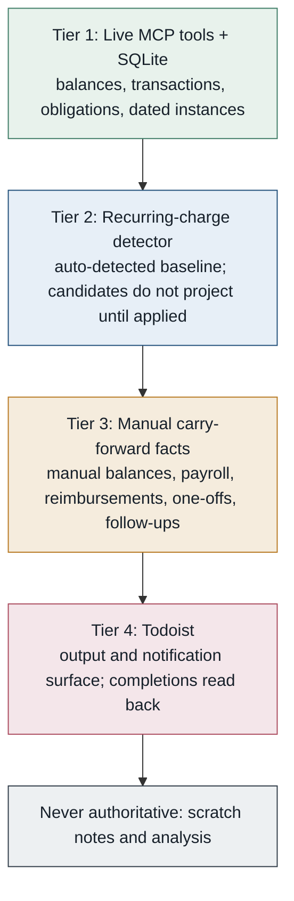
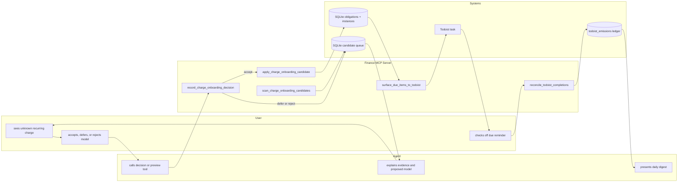
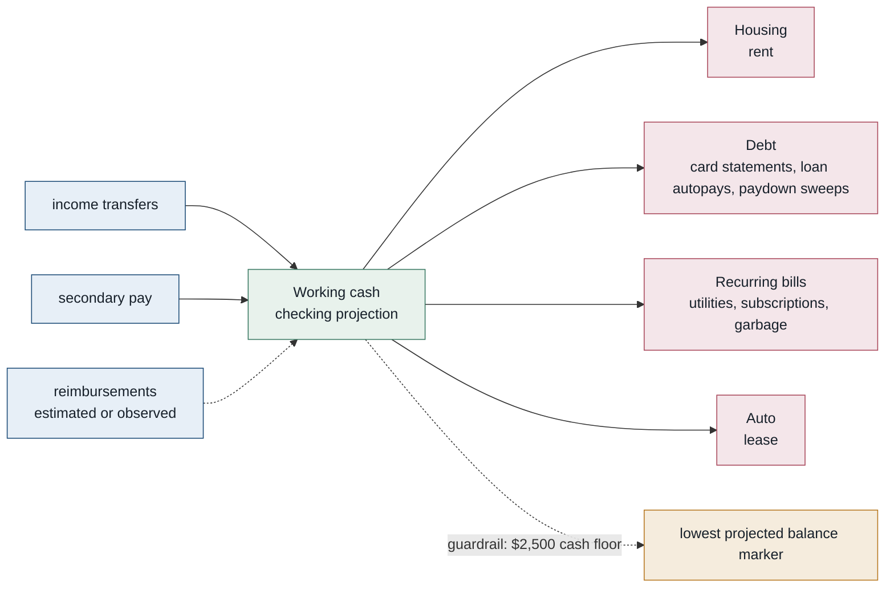

# Finance Agent Diagrams

Durable Mermaid diagrams for the local finance MCP server. These diagrams describe the intended architecture and state model without depending on local SQLite data, credentials, or temporary rendered artifacts.

## System Architecture

## Daily Finance Loop

```mermaid
flowchart LR
    subgraph Ingest["1. INGEST"]
        Sync["sync_simplefin<br/>pull SimpleFIN balances + transactions"]
        Manual["set_manual_balance<br/>record current portal balance when a feed is stale"]
        CardPaste["import_card_statement<br/>paste a card statement when a card has no live feed (dry-run by default)"]
        TodoistRead["reconcile_todoist_completions<br/>read completion state for emitted tasks"]
    end

    subgraph Model["2. MODEL"]
        Discover["scan_charge_onboarding_candidates<br/>discover recurring charge candidates"]
        Reconcile["reconcile_obligation_instances<br/>match expected payments to transactions"]
        Drift["detect_drift<br/>flag stale estimates, missing payments, amount changes"]
        Guardrails["evaluate_guardrails<br/>cash floor, drift threshold, debt order"]
        Projection["get_finance_status / get_daily_digest<br/>project cash flow from obligation_instances"]
    end

    subgraph Surface["3. SURFACE"]
        Queue["get_surface_queue<br/>collect what needs attention"]
        Digest["get_daily_digest<br/>status color, working cash, upcoming obligations"]
        Push["surface_due_items_to_todoist<br/>upsert tasks through todoist_emissions"]
    end

    Ingest --> Model --> Surface
    Surface -. "daily schedule / next read-back" .-> Ingest
```

## Daily Run Sequence

## Database Relationship View

## Candidate Lifecycle

## Obligation Instance Lifecycle

## Todoist Emission Lifecycle

## Source Of Truth Precedence

## User / Agent / System Swimlane

## Cash-Flow Template

This is a structural view only. Live amounts should come from `get_finance_status` or `get_daily_digest`; do not hard-code private balances into docs.

